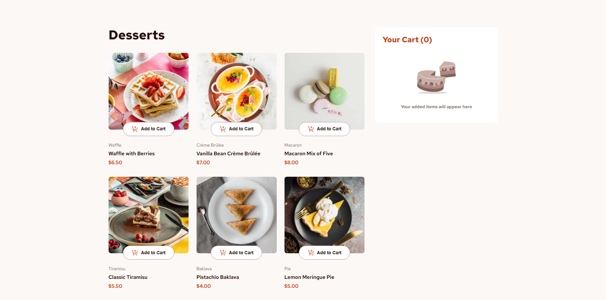

# Product List with Cart

An interactive food ordering application with a dynamic shopping cart, built as a solution to the **Product List With Cart** challenge from [Frontend Mentor](https://www.frontendmentor.io/challenges/product-list-with-cart-5MmqLVAp_d).

## 🚀 Live Demo

[View the live site](https://rodrigojesus7.github.io/product-list-with-cart/)

## 📸 Preview

## ✨ Features

* **Interactive Menu:** Browse through various food categories and items.
* **Dynamic Cart Management:** Add items, increment/decrement quantities, and remove products seamlessly.
* **Active State Styling:** Product images and buttons react dynamically when items are added to the cart.
* **Order Confirmation Modal:** Review your final order details and total price upon checkout.
* **Responsive Layout:** Optimized for mobile, tablet and desktop screens.

## 🛠️ Built With

* **HTML5** & Semantic markup
* **CSS3** (Custom Properties / CSS Variables, Flexbox, Responsive Design)
* **JavaScript** (DOM Manipulation, Array methods, Dynamic rendering)

## 🎯 What I Learned

Building this project was a great opportunity to reinforce core frontend concepts and tackle complex JavaScript logic:

* **DOM Manipulation & State Management:** Learned how to efficiently synchronize the UI with state changes, handling item additions, quantity increments/decrements, and deletions without relying on heavy frameworks.
* **Complex Array Methods:** Strengthened my skills in using native JavaScript methods (`find`, `findIndex`, `map`, `filter`, `reduce`) to calculate total prices and manage cart items dynamically.
* **Modular Architecture & CSS Variables:** Utilized CSS custom properties (`:root`) for maintainable theming and structured CSS files cleanly to support a fully responsive layout.

## 💡 Challenge

This project was created as part of a challenge from **Frontend Mentor**, which provides professional designs to help developers improve their frontend development skills.

The goal was to reproduce the provided design as accurately as possible while making the page responsive and interactive.

## 👨‍💻 Author

**Rodrigo Costa**

Frontend Developer in transition to technology, currently focused on improving my skills in HTML, CSS, JavaScript, React and TypeScript.